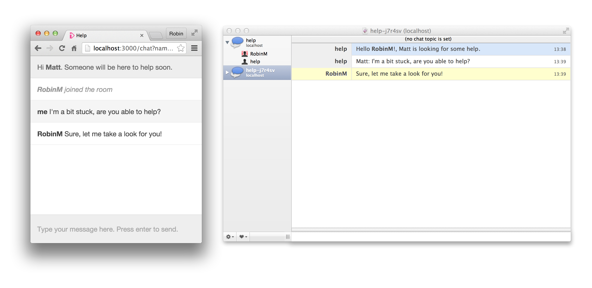

# help

> Live chat support powered by IRC

Users chat in their browser – you respond using IRC.



Join #help-demo on Freenode and start a chat at https://help-demo.herokuapp.com/ for a live demo.

## How it works

The _help_ server connects to your IRC server and creates an ad-hoc channel for each chat. It lets you know when a chat is created so you can join the channel and provide support. Messages are passed between the browser and the IRC server using WebSockets.

## Installation

```
git clone https://GitHub.com/robinjmurphy/help.git
cd help
node server.js
```

Open http://127.0.0.1:3000 in your web browser and click _Start chat_ to open a chat window.

## Configuration

Everything about help is configurable; from the basic IRC connection settings to the messages that it sends to you and your users. Edit the [`settings.js`](settings.js) file to configure the server, where each setting is documented.

## Launching a chat from your website

The server's index page includes a link to start a new chat. You can create you own button on your website just by linking to the server's `/chat` page in a new window.

To pass arbitrary data to the chat window from your website (a customer ID or name, for example) just set the query string when linking to the `/chat` page. All of the query parameters are accessible as Mustashe variables when you configure the message that is sent when someone joins a chat.

```
/chat?name=robin
```

In [`settings.js`](settings.js):

```
join: "You're chatting to {{name}}"
```
